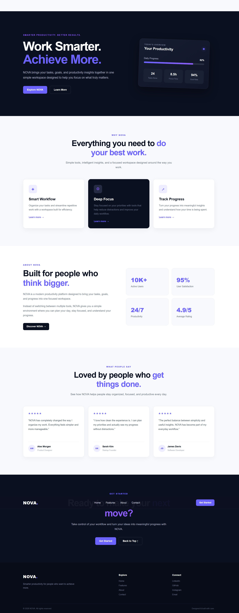

# NOVA — AI Productivity Landing Page

A modern, responsive landing page for NOVA, a fictional AI-powered productivity platform. This project was created as part of the Oasis Infobyte Web Development & Designing Internship — Level 1, Task 1.

## 📌 Project Overview

NOVA is a professional SaaS-style landing page designed to present an AI productivity platform in a clean, modern, and user-friendly way.

The website focuses on:

- Clear product presentation
- Modern visual design
- Responsive layouts
- Simple navigation
- Strong call-to-action sections

## 🎯 Objective

The objective of this project is to demonstrate foundational web development and designing skills using HTML5 and CSS3.

## 🛠️ Technologies Used

- HTML5
- CSS3
- CSS Flexbox
- CSS Grid
- Responsive Media Queries

## ✨ Features

- Sticky navigation bar
- Home, Features, About, and Contact navigation links
- Hero section with headline and call-to-action buttons
- Features section with three feature cards
- About section with productivity statistics
- Testimonials section
- Final call-to-action section
- Contact and social media placeholders
- Professional footer
- Smooth scrolling navigation
- Hover effects
- Responsive design for desktop, tablet, and mobile devices
- Consistent color palette and typography
- Mobile-friendly layouts using CSS Grid and Flexbox

## 📱 Responsive Design

The website has been designed to work across different screen sizes, including:

- Desktop
- Tablet
- Mobile

Responsive CSS media queries adjust layouts, typography, cards, buttons, navigation, and footer elements for smaller screens.

## 📁 Project Structure

```text
WebDev-L1-LandingPage/
│
├── screenshots/
│   └── landing-page-home.png
│
├── index.html
├── style.css
└── README.md
```

## 📸 Screenshots

### Desktop Preview



## 🚀 How to Run

1. Download or clone the project.
2. Open the `WebDev-L1-LandingPage` folder.
3. Open `index.html` in a web browser.

For development, the project can also be opened using the Live Server extension in Visual Studio Code.

## 🎨 Design

The landing page uses a modern SaaS-inspired design with:

- Deep navy backgrounds
- Purple accent colors
- Clean typography
- Rounded cards
- Subtle shadows
- Hover interactions
- Responsive spacing

## 👩‍💻 Author

**Dipti Nishad**

Web Development & Designing Intern  
Oasis Infobyte

## 📄 Internship Task

**Track:** Web Development & Designing  
**Level:** Level 1  
**Task:** Task 1 — Landing Page

---

© 2026 NOVA. All rights reserved.